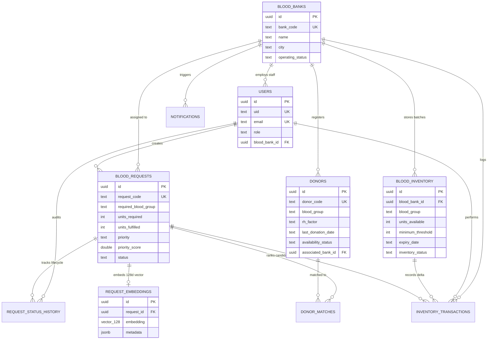

# BloodLink Entity-Relationship (ER) Diagram

```mermaid
erDiagram
    BLOOD_BANKS ||--o{ USERS : "employs staff"
    BLOOD_BANKS ||--o{ DONORS : "registers"
    BLOOD_BANKS ||--o{ BLOOD_INVENTORY : "stores batches"
    BLOOD_BANKS ||--o{ BLOOD_REQUESTS : "assigned to"
    BLOOD_BANKS ||--o{ INVENTORY_TRANSACTIONS : "logs"
    BLOOD_BANKS ||--o{ NOTIFICATIONS : "triggers"

    USERS ||--o{ BLOOD_REQUESTS : "creates"
    USERS ||--o{ REQUEST_STATUS_HISTORY : "audits"
    USERS ||--o{ INVENTORY_TRANSACTIONS : "performs"

    BLOOD_INVENTORY ||--o{ INVENTORY_TRANSACTIONS : "records delta"

    BLOOD_REQUESTS ||--o| REQUEST_EMBEDDINGS : "embeds 128d vector"
    BLOOD_REQUESTS ||--o{ DONOR_MATCHES : "ranks candidates"
    BLOOD_REQUESTS ||--o{ REQUEST_STATUS_HISTORY : "tracks lifecycle"
    BLOOD_REQUESTS ||--o{ INVENTORY_TRANSACTIONS : "allocates units"

    DONORS ||--o{ DONOR_MATCHES : "matched to"

    BLOOD_BANKS {
        uuid id PK
        text bank_code UK
        text name
        text city
        text operating_status
    }
    USERS {
        uuid id PK
        text uid UK
        text email UK
        text role
        uuid blood_bank_id FK
    }
    DONORS {
        uuid id PK
        text donor_code UK
        text blood_group
        text rh_factor
        text last_donation_date
        text availability_status
        uuid associated_bank_id FK
    }
    BLOOD_INVENTORY {
        uuid id PK
        uuid blood_bank_id FK
        text blood_group
        int units_available
        int minimum_threshold
        text expiry_date
        text inventory_status
    }
    BLOOD_REQUESTS {
        uuid id PK
        text request_code UK
        text required_blood_group
        int units_required
        int units_fulfilled
        text priority
        double priority_score
        text status
    }
    REQUEST_EMBEDDINGS {
        uuid id PK
        uuid request_id FK
        vector_128 embedding
        jsonb metadata
    }
```
